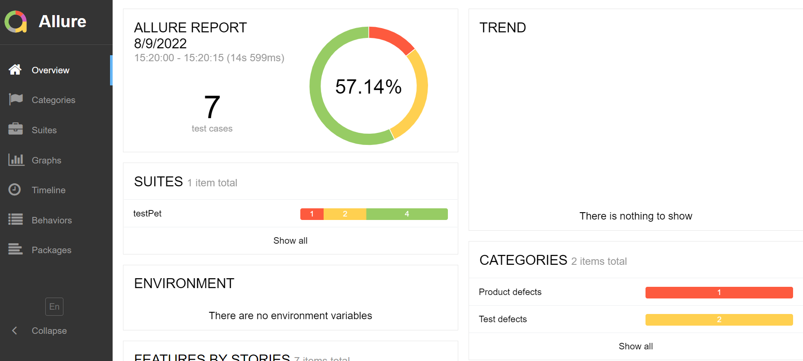
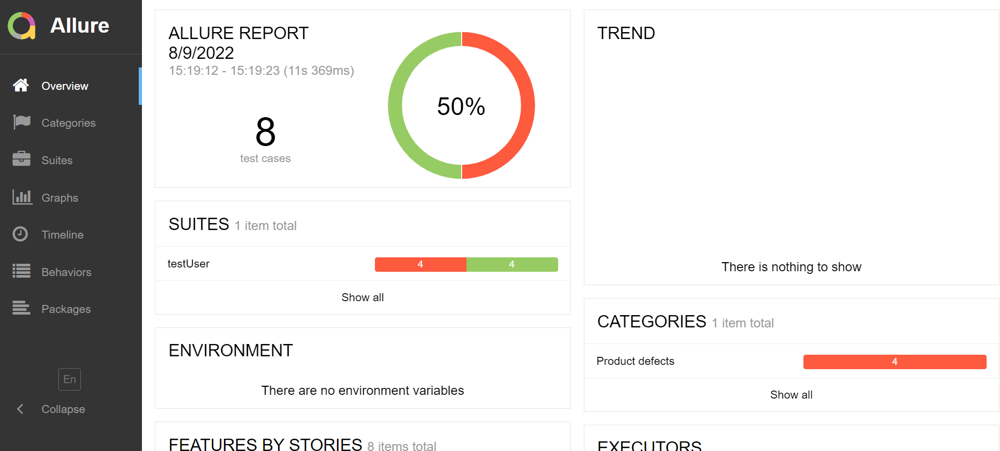
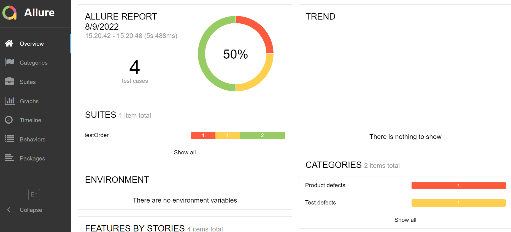

# How to Run Tests 
### by tamar samara


## test pet allure


## test user allure


## test order allure


## You can run all passed tests:

```pytest .\testPet.py -k passed```

## You can run all failed tests:

```pytest .\testPet.py -k failed```